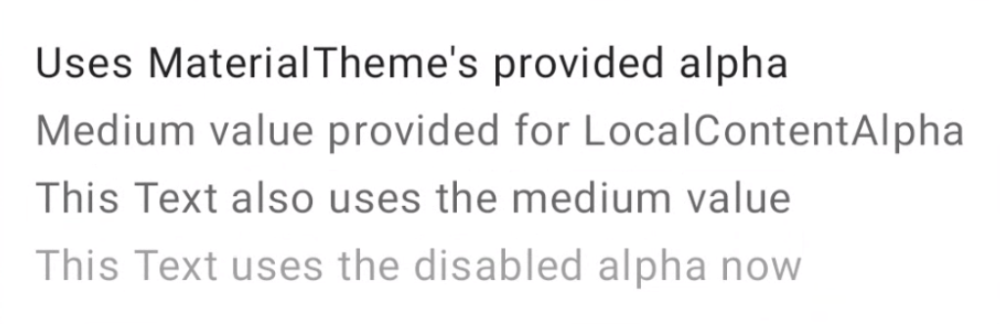

### Material 3 Theme Builder & Apply into code:
Theme build form Material Builder provides the Colors.kt and Theme.kt file. Which contains all the necessary color variants to use directly. Change the package and the `AppTheme` as necessary. Also add typography to Material initialization.

```kotlin
@Composable
fun ReplyTheme (
  useDarkTheme: Boolean = isSystemInDarkTheme(),
  content: @Composable() () -> Unit
) {
  val colors = if (!useDarkTheme) {
    LightColors
  } else {
    DarkColors
  }

  MaterialTheme(
    colorScheme = colors,
    content = content,
    typography = Typography
  )
}
```

### Color roles note:
`Primary` is the base color, which is used for the main components like prominent buttons and active states.

The `secondary` key color is used for less prominent components in the UI, such as filter chips.

The `tertiary` key color is used to provide contrasting accents, and neutral colors are used for the background and surfaces in the app.

Use `on-primary` on top of `primary`, `on-primary-container` on top of `primary-container`, and the same for other accent and neutral colors to provide accessible contrast to the user. Neutral colors are for Background and Surfaces

### Surface to Wrap the App inside AppTheme:
start by wrapping the main app composable in a Surface() to provide the base for the app's content to be placed on top of it. 
```kotlin
AppTheme {
   Surface(tonalElevation = 5.dp) {
       ReplyApp(
           replyHomeUIState = uiState,
          // other parameters
         )
   }
}
```

### Container and Content Color:
Some material components have slot for `Container` and `Content` color (ie, `LargeFloatingActionButton` & `Card`). 

```kotlin
// FAB -> Floating Action Button
LargeFloatingActionButton(
    containerColor = MaterialTheme.colorScheme.tertiaryContainer,
    contentColor = MaterialTheme.colorScheme.onTertiaryContainer
  ){
   /*..*/   
  }

Card(
   modifier =  modifier
       .clickable { navigateToDetail(email.id) },
   colors = CardDefaults.cardColors(
       containerColor = if (email.isImportant)
           MaterialTheme.colorScheme.secondaryContainer
       else MaterialTheme.colorScheme.surfaceVariant
   )
){
  /*..*/   
}
```

### Dynamic Color (Dynamic Theme from user's wallpaper):
Dynamic color is available on Android 12 and above. If dynamic color is available, you can set up a dynamic color scheme using dynamicDarkColorScheme() or dynamicLightColorScheme(). If not, you should fall back to using a default light or dark ColorScheme.
```kotlin
@Composable
fun AppTheme(
   useDarkTheme: Boolean =  isSystemInDarkTheme(),
   content: @Composable () -> Unit
) {
   val context = LocalContext.current
   val colors = when {
       (Build.VERSION.SDK_INT >= Build.VERSION_CODES.S) -> {
           if (useDarkTheme) dynamicDarkColorScheme(context)
           else dynamicLightColorScheme(context)
       }
       useDarkTheme -> DarkColors
       else -> LightColors
   }
   
      MaterialTheme(
       colorScheme = colors,
       content = content
     )
}
```

### LocalContext, LocalView:
There are comes from CompositionLocal Object and are available inside @Composable.

`LocalContext.current` is available from Composable Functions.


### CompositionLocal:
* CompositionLocal is a tool for passing data down through the Composition implicitly. 

Compose offers `CompositionLocal` which allows you to create tree-scoped named objects that can be used as an implicit way to have data flow through the UI tree. The current value of a CompositionLocal corresponds to the closest value provided by an ancestor in that part of the Composition.


* Note: CompositionLocal objects or constants are usually prefixed with `Local` to allow better discoverability with auto-complete in the IDE.

CompositionLocal is what the Material theme uses under the hood. MaterialTheme is an object that provides three CompositionLocal instances——colors, typography and shapes——allowing you to retrieve them later in any descendant part of the Composition. Specifically, these are the LocalColors, LocalShapes, and LocalTypography properties that you can access through the MaterialTheme colors, shapes, and typography attributes.

* Note: CompositionLocal works well for foundational architecture and Jetpack Compose makes heavy use of it.

Docs: https://developer.android.com/jetpack/compose/compositionlocal

```kotlin
@Composable
fun MyApp() {
    // Provides a Theme whose values are propagated down its `content`
    MaterialTheme {
        // New values for colors, typography, and shapes are available
        // in MaterialTheme's content lambda.

        // ... content here ...
    }
}

// Some composable deep in the hierarchy of MaterialTheme
@Composable
fun SomeTextLabel(labelText: String) {
    Text(
        text = labelText,
        // `primary` is obtained from MaterialTheme's
        // LocalColors CompositionLocal
        color = MaterialTheme.colors.primary
    )
}
```
* Setting new value

```kotlin
@Composable
fun CompositionLocalExample() {
    MaterialTheme { // MaterialTheme sets ContentAlpha.high as default
        Column {
            Text("Uses MaterialTheme's provided alpha")
            CompositionLocalProvider(LocalContentAlpha provides ContentAlpha.medium) {
                Text("Medium value provided for LocalContentAlpha")
                Text("This Text also uses the medium value")
                CompositionLocalProvider(LocalContentAlpha provides ContentAlpha.disabled) {
                    DescendantExample()
                }
            }
        }
    }
}

@Composable
fun DescendantExample() {
    // CompositionLocalProviders also work across composable functions
    Text("This Text uses the disabled alpha now")
}
```


### Custom CompositionLocal:
There are two APIs to create a CompositionLocal, `compositionLocalOf` and `staticCompositionLocalOf`, see details (https://developer.android.com/jetpack/compose/compositionlocal#creating-apis)
```kotlin
// Creating a CompositionLocal
// LocalElevations.kt file

data class Elevations(val card: Dp = 0.dp, val default: Dp = 0.dp)

// Define a CompositionLocal global object with a default
// This instance can be accessed by all composables in the app
val LocalElevations = compositionLocalOf { Elevations() }


// Providing values to a CompositionLocal
class MyActivity : ComponentActivity() {
    override fun onCreate(savedInstanceState: Bundle?) {
        super.onCreate(savedInstanceState)

        setContent {
            // Calculate elevations based on the system theme
            val elevations = if (isSystemInDarkTheme()) {
                Elevations(card = 1.dp, default = 1.dp)
            } else {
                Elevations(card = 0.dp, default = 0.dp)
            }

            // Bind elevation as the value for LocalElevations
            CompositionLocalProvider(LocalElevations provides elevations) {
                // ... Content goes here ...
                // This part of Composition will see the `elevations` instance
                // when accessing LocalElevations.current
            }
        }
    }
}


//Consuming the CompositionLocal
@Composable
fun SomeComposable() {
    // Access the globally defined LocalElevations variable to get the
    // current Elevations in this part of the Composition
    Card(elevation = LocalElevations.current.card) {
        // Content
    }
}
```

### SideEffect:
`SideEffect` guarantees that the effect (callback) executes after every successful recomposition (not before re-composition).

```kotlin
@Composable
fun someFun() {

    // Add primary status bar color from chosen color scheme. the SideEffect Block will run only after composition/re-composition.
    val view = LocalView.current
    if (!view.isInEditMode) {
        SideEffect {
            val window = (view.context as Activity).window
            window.statusBarColor = colors.primary.toArgb()
            WindowCompat
                .getInsetsController(window, view)
                .isAppearanceLightStatusBars = useDarkTheme
        }
    }
}
```

Docs: https://developer.android.com/jetpack/compose/side-effects#sideeffect-publish

### Window and WindowCompat:
`Window` is the Abstract base class for a top-level window look and behavior policy. An instance of this class should be used as the top-level view added to the window manager. It provides standard UI policies such as a background, title area, default key processing, etc.

The framework will instantiate an implementation of this class on behalf of the application.

`WindowCompat` is the Helper for accessing features in Window.

```kotlin
// Add primary status bar color from chosen color scheme.
val view = LocalView.current
if (!view.isInEditMode) {
    SideEffect {
        val window = (view.context as Activity).window
        window.statusBarColor = colors.primary.toArgb()

        WindowCompat
            .getInsetsController(window, view)
            .isAppearanceLightStatusBars = useDarkTheme /* If true, changes the foreground color of the status bars to light so that the items on the bar can be read clearly. If false, reverts to the default appearance */
            // .setAppearanceLightStatusBars(useDarkTheme) // can also be use
        /* Note: Status bar icon color can be light or dark, no custom color setting is available */
    }
}
```
### Typography Material3 Design:
If not specified, all text fields uses `Typography.bodyLarge` (`LocalTextStyle.curren`) by default.

Once `typography` parameter is set when initializing Material Component, the defined type can be used directly using `Material.typography.<name>`.

```kotlin
// applying defined typography
Text(
   text = "Something"
   style = MaterialTheme.typography.labelMedium
)
```
### Shapes:
Material surfaces can be displayed in different shapes. Shapes direct attention, identify components, communicate state, and express brand.

Compose provides the Shapes class with expanded parameters to implement new M3 shapes.

* There are different sizes of shapes in the shape scale. Shapes should defined in a separate file `Shape.kt`, similar to `Type.kt` and `Color.kt`. And include that in Material initialization. 

```kotlin
// Define shape in Shape.kt
val shapes = Shapes(
   extraSmall = RoundedCornerShape(4.dp),
   small = RoundedCornerShape(8.dp),
   medium = RoundedCornerShape(16.dp),
   large = RoundedCornerShape(24.dp),
   extraLarge = RoundedCornerShape(32.dp)
)

// include shape while initializing Material Theme
@Composable
fun AppTheme(
   useDarkTheme: Boolean = isSystemInDarkTheme(),
   content: @Composable() () -> Unit
) {
  // dynamic theming content
   MaterialTheme(
       colorScheme = colors,
       typography = typography,
       shapes = shapes,
       content = content
   )
}
```

* Like typography and color, use reference shape with `MaterialTheme.shapes.<shapeName>`


```kotlin
Card(shape = MaterialTheme.shapes.medium) { /* card content */ }
FloatingActionButton(shape = MaterialTheme.shapes.large) { /* fab content */}
```

* There are two other shapes available to use — `RectangleShape` and `CircleShape` — which are part of Compose. Rectangle shape has no border radius, and circle shape shows full circled edges.

* You can also apply shape to your Components using Modifiers that take shapes, like `Modifier.clip`, `Modifier.background`, and `Modifier.border`.


### Emphasis:
Emphasis in the UI helps you to highlight some content over the other.

There are two ways to add emphasis
1. Using surface, surface-variant, and background alongside on-surface and on-surface-variants colors from the defined M3 color system.

2. Using different font weights for text. You can provide custom weights to your type scale for providing different emphasis.

### Font Styling:
- Prefetching Font

- Font Variation API

- BuildAnnotatedString for adding different text style/highlighter to a portion of a text-block.

- TextField's `textFieldColor` and `outlinedTextFieldColor` targeting `focusedIndicatorColor` and `unfocusedIndicatorColor`

- BasicText and BasicTextField for non-styled alternative that can be more customizable.

### Material and Foundation Layer:
Material Theme has Styled layer as `Material Layer` (ie, Text, TextField) and unStyled layer (with more control) as `Foundation Layer` (ie, BasicText, BasicTextField).

#### ---------------- Compose Animation ---------------------

### `animate*AsState()` | Value Based Animation:
The animate*AsState functions are the simplest animation APIs in Compose for animating a single value. You only provide the target value (or end value), and the API starts animation from the current value to the specified value.. ie, `animateColorAsState`, `animateFloatAsState`.

Out of the box, Float, Color, Dp, Size, Offset, Rect, Int, IntOffset, and IntSize are available. Support animation for custom data types by providing a `TwoWayConverter` to `animateValueAsState` that takes a generic type

```kotlin
private enum class TabPage { Home, Work }
var tabPage by remember { mutableStateOf(TabPage.Home) }

/* animateColorAsState will animate the color if the target value changed (only on re-compose) */
val backgroundColor by animateColorAsState(targetValue = if (tabPage == TabPage.Home) Purple100 else Green300,
    label = "background color", finishedListener = { (color) ->
        Log.d("BackgroundColor", "Changing Background Color to $color")
    })
```

Docs: https://developer.android.com/jetpack/compose/animation/value-based#animate-as-state

### `updateTransition` | Value Based Animation:
creates a transition object that can manage multiple animating values and run them based on a state change.

Docs: https://developer.android.com/jetpack/compose/animation/value-based#updateTransition

### `transition` with `AnimatedVisibility` and `AnimatedContent` | Value Based Animation:
Docs: https://developer.android.com/jetpack/compose/animation/value-based#use-transition-with-animatedvisibility-and-animatedcontent

### `rememberInfiniteTransition` | Value Based Animation:
is similar to `updateTransition`, but it creates an infinite transition that can manage multiple animations that keep on running indefinitely. 

Docs: https://developer.android.com/jetpack/compose/animation/value-based#rememberinfinitetransition


### `animateVisibility(boolean)`:
runs its animation every time the specified Boolean State value changes. `AnimatedVisibility( visible = Boolean, enter = fnIn(), exit = fnOut())`

Animation in RowScope's default is `enter: EnterTransition = fadeIn() + expandHorizontally()` and `exit: ExitTransition = fadeOut() + shrinkHorizontally()`. This can be changed as necessary like `slideInVertically()` or `slideOutVertically()` (which are ColumnScopes default cases)

```kotlin
// Use `FloatingActionButton` rather than `ExtendedFloatingActionButton` for full control on how it should animate.
// onClick will be supplied from top level caller as Uni-directional-data-flow (State passed down, events goes up)
FloatingActionButton(onClick = onClick) {
    Row(
        modifier = Modifier.padding(horizontal = 16.dp)
    ) {
        Icon(
            imageVector = Icons.Default.Edit,
            contentDescription = null
        )

        // note: extended is coming form parent (hoisted) state
        // Toggle the visibility of the content with animation.
        AnimatedVisibility (extended) { // just changing if (Boolean) to AnimatedVisibility (Boolean) will make the view revealing animate
            Text(
                text = stringResource(R.string.edit),
                modifier = Modifier
                    .padding(start = 8.dp, top = 3.dp)
            )
        }
    }
}

/*
// applying enter and exit
AnimatedVisibility(
    visible = shown,
    enter = slideInVertically(
        // Enters by sliding down from offset -fullHeight to 0.
        initialOffsetY = { fullHeight -> -fullHeight },
        animationSpec = tween(durationMillis = 150, easing = LinearOutSlowInEasing)
    ),
    exit = slideOutVertically(
        // Exits by sliding up from offset 0 to -fullHeight.
        targetOffsetY = { fullHeight -> -fullHeight },
        animationSpec = tween(durationMillis = 250, easing = FastOutLinearInEasing)
    )
)
*/
```

### ColumnScope and RowScope:
Custom Composable can be set desired scope using `<ScopeName>.CustomComposable(){...}` pattern. Also when calling, The custom composable should wrapped with the Scope. 
```kotlin
// calling
Column {
    CustomComposable()
}

// defining
@Composable
private fun ColumnScope.CustomComposable() {/*....*/}
```
### Animation Using `Modifier.animateContentSize()`:
When a Column/Row Scopes Content Size changes (expand/shrink), `animatedContentSize()` can be used for quick animation
```kotlin
Column(
    modifier = Modifier
        .fillMaxWidth()
        .padding(16.dp)
        .animateContentSize()
) {

    Icon(
        imageVector = Icons.Default.Info,
        contentDescription = null
    )

    Spacer(modifier = Modifier.width(16.dp))

    if (expanded) {
        Spacer(modifier = Modifier.height(8.dp))
        Text(
            text = stringResource(R.string.lorem_ipsum),
            textAlign = TextAlign.Justify
        )
    }
}
```

### TabRow in Scaffold:
We can place TabRow in Scaffold's `topBar` callback param.
See more on <a href="./Apps/Animation-Compose-1/">Animation Compose Example</a>
```kotlin
private enum class TabPage {
    Home, Work
}

@Composable
fun Home() {
    // ....
    var tabPage by remember { mutableStateOf(TabPage.Home) }
    // ....
    Scaffold(
        topBar = {
            HomeTabBar(
                backgroundColor = backgroundColor,
                tabPage = tabPage,
                onTabSelected = { tabPage = it }
            )
        },
        // ....
){}
}

@Composable
private fun HomeTabBar(
    backgroundColor: Color,
    tabPage: TabPage,
    onTabSelected: (tabPage: TabPage) -> Unit
) {
    TabRow(
        selectedTabIndex = tabPage.ordinal,
        backgroundColor = backgroundColor,
        indicator = { tabPositions ->
//            val context = LocalContext.current
//            LaunchedEffect(backgroundColor) {
//                launch {
//                    Toast.makeText(context, "$tabPositions", Toast.LENGTH_SHORT).show()
//                }
//            }
            HomeTabIndicator(tabPositions, tabPage)
        }
    ) {
        HomeTab(
            icon = Icons.Default.Home,
            title = stringResource(R.string.home),
            onClick = { onTabSelected(TabPage.Home) }
        )
        HomeTab(
            icon = Icons.Default.AccountBox,
            title = stringResource(R.string.work),
            onClick = { onTabSelected(TabPage.Work) }
        )
    }
}

@Composable
private fun HomeTabIndicator(
    tabPositions: List<TabPosition>,
    tabPage: TabPage
) {
    // TODO 4: Animate these value changes.
    val indicatorLeft = tabPositions[tabPage.ordinal].left
    val indicatorRight = tabPositions[tabPage.ordinal].right
    val color = if (tabPage == TabPage.Home) Purple700 else Green800
    Box(
        Modifier
            .fillMaxSize()
            .wrapContentSize(align = Alignment.BottomStart)
            .offset(x = indicatorLeft)
            .width(indicatorRight - indicatorLeft)
            .padding(4.dp)
            .fillMaxSize()
            .border(
                BorderStroke(2.dp, color), RoundedCornerShape(4.dp)
            )
    )
}

@Composable
private fun HomeTab(
    icon: ImageVector,
    title: String,
    onClick: () -> Unit,
    modifier: Modifier = Modifier
) {
    Row(
        modifier = modifier
            .clickable(onClick = onClick)
            .padding(16.dp),
        horizontalArrangement = Arrangement.Center,
        verticalAlignment = Alignment.CenterVertically
    ) {
        Icon(
            imageVector = icon,
            contentDescription = null
        )
        Spacer(modifier = Modifier.width(16.dp))
        Text(text = title)
    }
}
```

### Animate multiple values using `Transition` API:
`Transition` API allows us to track when all animations on a Transition are finished, which is not possible when using individual `animate*AsState` APIs. This also allows us to define different `transitionSpec`'s when transitioning between different states.

To animate multiple values (like left and right position) simultaneousl, a Transition can be created with the `updateTransition` function.

Each animating value can be declared with the `animate* `extension functions of Transition, like `animateDp` and `animateColor`, those take lambda block and we can inject state there. 

```kotlin
//@SuppressLint("UnusedTransitionTargetStateParameter")
@Composable
private fun HomeTabIndicator(
    tabPositions: List<TabPosition>,
    tabPage: TabPage
) {
    // TODO 4: Animate these value changes.
    val transition = updateTransition(targetState = tabPage, label = "Tab Indicator Animation")

    val indicatorLeft by transition.animateDp(label = "Indicator left") {
        // tabPositions[tabPage.ordinal].left // state is passed as it, so no need to use global state, it also require a suppress warning for unused state param 
        tabPositions[it.ordinal].left
    }
    val indicatorRight by transition.animateDp(label = "Indicator right") {
        tabPositions[it.ordinal].right
    }
    val color by transition.animateColor (label = "Border Color") {
        if (it == TabPage.Home) Purple700 else Green800
    }
    Box(
        Modifier
            .fillMaxSize()
            .wrapContentSize(align = Alignment.BottomStart)
            .offset(x = indicatorLeft)
            .width(indicatorRight - indicatorLeft)
            .padding(4.dp)
            .fillMaxSize()
            .border(
                BorderStroke(2.dp, color), RoundedCornerShape(4.dp)
            )
    )
}
```

* with transitionSpec

```kotlin
//@SuppressLint("UnusedTransitionTargetStateParameter")
@Composable
private fun HomeTabIndicator(
    tabPositions: List<TabPosition>,
    tabPage: TabPage
) {
    // TODO 4: Animate these value changes.
    val transition = updateTransition(targetState = tabPage, label = "Tab Indicator Animation")

    val indicatorLeft by transition.animateDp(transitionSpec = {
        if (TabPage.Home isTransitioningTo TabPage.Work) {
            // Indicator moves to the right
            // The right edge moves faster than the left edge.
            spring(stiffness = Spring.StiffnessMedium)
        } else {
            // Indicator moves to the left.
            // The right edge moves slower than the left edge.
            spring(stiffness = Spring.StiffnessVeryLow)
        }
    },
        label = "Indicator left") {
        // tabPositions[tabPage.ordinal].left // state is passed as it, so no need to use global state, it also require a suppress warning for unused state param
        tabPositions[it.ordinal].left
    }
    val indicatorRight by transition.animateDp(transitionSpec = {
        if (TabPage.Home isTransitioningTo TabPage.Work) {
            // Indicator moves to the right
            // The right edge moves faster than the left edge.
            spring(stiffness = Spring.StiffnessMedium)
        } else {
            // Indicator moves to the left.
            // The right edge moves slower than the left edge.
            spring(stiffness = Spring.StiffnessVeryLow)
        }
    },
        label = "Indicator right") {
        tabPositions[it.ordinal].right
    }
    val color by transition.animateColor (label = "Border Color") {
        if (it == TabPage.Home) Purple700 else Green800
    }
    Box(
        Modifier
            .fillMaxSize()
            .wrapContentSize(align = Alignment.BottomStart)
            .offset(x = indicatorLeft)
            .width(indicatorRight - indicatorLeft)
            .padding(4.dp)
            .fillMaxSize()
            .border(
                BorderStroke(2.dp, color), RoundedCornerShape(4.dp)
            )
    )
}
```

### Alpha (Opacity) Infinite animation:
```kotlin
val alpha by rememberInfiniteTransition(label = "rememberInfiniteTransition of alpha").animateFloat(
    initialValue = 0.3f,
    targetValue = 1f,
    animationSpec = infiniteRepeatable(repeatMode = RepeatMode.Reverse ,animation = keyframes {
        durationMillis = 1000
        0.7f at 500 // infix function
        0.9f.at(700) // can write this way too
    }),
    label = "infinite alpha animation"
)
```

### TransitionSpec and AnimationSpec:

### keyframe animation:

### `Animatable` (Lowest level animation API) and Gesture animation:
Custom Modifier can be created with `Animatable API` to handle Gesture animation.
Though this can be achieve using Material's `SwipeToDismiss` layout without building custom modifier.

Animatable comes form `androidx.compose.animation.core.Animatable`,
It's a low level animation API. For gesture animation it has the ability to snap instantly to the new value coming in from a gesture and stop any ongoing animation when a new touch event is triggered.

```kotlin
/**
 * The modified element can be horizontally swiped away.
 *
 * @param onDismissed Called when the element is swiped to the edge of the screen.
 */

private fun Modifier.swipeToDismiss( onDismissed: () -> Unit ): Modifier = composed { // can be written `Modifier.composed{}` as well
    // TODO 6-1: Create an Animatable instance for the offset of the swiped element.

    val offsetX = remember { Animatable(0f) }

    pointerInput(Unit) {
        // Used to calculate a settling position of a fling animation.
        val decay = splineBasedDecay<Float>(this)
        // Wrap in a coroutine scope to use suspend functions for touch events and animation.
        coroutineScope {
            while (true) {
                // Wait for a touch down event on the caller/attached composable
                val pointerId = awaitPointerEventScope { awaitFirstDown().id }
                // TODO 6-2: Touch detected; the animation should be stopped.
                offsetX.stop() // cancel any on-going animations

                // Prepare for drag events and record velocity of a fling.
                val velocityTracker = VelocityTracker()
                // Wait for drag events.
                awaitPointerEventScope {
                    horizontalDrag(pointerId) { change ->
                        // TODO 6-3: Apply the drag change to the Animatable offset.
                        val horizontalDragOffset = offsetX.value + change.positionChange().x

                        launch {
                            // Instantly set the Animable to the dragOffset to ensure its moving
                            // as the user's finger moves
                            offsetX.snapTo(horizontalDragOffset)
                        }

                        // Record the velocity of the drag.
                        velocityTracker.addPosition(change.uptimeMillis, change.position)
                        // Consume the gesture event, not passed to external
                        if (change.positionChange() != Offset.Zero) change.consume()
                    }
                }
                // Dragging finished. Calculate the velocity of the fling.
                val velocity = velocityTracker.calculateVelocity().x
                // TODO 6-4: Calculate the eventual position where the fling should settle
                //           based on the current offset value and velocity
                val targetOffsetX = decay.calculateTargetValue(offsetX.value, velocity)
                // TODO 6-5: Set the upper and lower bounds so that the animation stops when it
                //           reaches the edge.

                offsetX.updateBounds(
                    lowerBound = - size.width.toFloat(), // size is comming form PointerInputScope
                    upperBound = size.width.toFloat() // or this@pointerInput.size.width.toFloat()
                )

                launch {
                    // TODO 6-6: Slide back the element if the settling position does not go beyond
                    //           the size of the element. Remove the element if it does.
                    if (targetOffsetX.absoluteValue <= this@pointerInput.size.width) {
                        // Not enough velocity; Slide back.
                        offsetX.animateTo(targetValue = 0f, initialVelocity = velocity)
                    } else {
                        // Enough velocity to slide away the element to the edge.
                        offsetX.animateDecay(velocity, decay)
                        // The element was swiped away.
                        onDismissed() // calling the deletion callbacks
                    }
                }
            }
        }
    }
        .offset {
            // TODO 6-7: Use the animating offset value here.
            IntOffset(offsetX.value.roundToInt(), 0)
        }
}
```

### Common Delegated Property in Jetpack Compose:
`var someState by remember { mutableStateOf(SomeThing) }`

`var someComputedState by remember { derivedStateOf(/*process and return some computation based on another state*/) }`

`val lazyListState = rememberLazyListState()`: Creates a LazyListState that is remembered across compositions.

`val backgroundColor by animateColorAsState(/*....*/)`

`val alpha by rememberInfiniteTransition(label = "infinite animation").animateFloat(....)`

