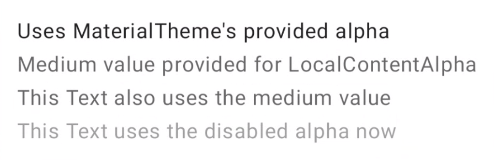

### Material 3 Theme Builder & Apply into code:
Theme build form Material Builder provides the Colors.kt and Theme.kt file. Which contains all the necessary color variants to use directly. Change the package and the `AppTheme` as necessary. Also add typography to Material initialization.

```kotlin
@Composable
fun ReplyTheme (
  useDarkTheme: Boolean = isSystemInDarkTheme(),
  content: @Composable() () -> Unit
) {
  val colors = if (!useDarkTheme) {
    LightColors
  } else {
    DarkColors
  }

  MaterialTheme(
    colorScheme = colors,
    content = content,
    typography = Typography
  )
}
```

### Color roles note:
`Primary` is the base color, which is used for the main components like prominent buttons and active states.

The `secondary` key color is used for less prominent components in the UI, such as filter chips.

The `tertiary` key color is used to provide contrasting accents, and neutral colors are used for the background and surfaces in the app.

Use `on-primary` on top of `primary`, `on-primary-container` on top of `primary-container`, and the same for other accent and neutral colors to provide accessible contrast to the user. Neutral colors are for Background and Surfaces

### Surface to Wrap the App inside AppTheme:
start by wrapping the main app composable in a Surface() to provide the base for the app's content to be placed on top of it. 
```kotlin
AppTheme {
   Surface(tonalElevation = 5.dp) {
       ReplyApp(
           replyHomeUIState = uiState,
          // other parameters
         )
   }
}
```

### Container and Content Color:
Some material components have slot for `Container` and `Content` color (ie, `LargeFloatingActionButton` & `Card`). 

```kotlin
// FAB -> Floating Action Button
LargeFloatingActionButton(
    containerColor = MaterialTheme.colorScheme.tertiaryContainer,
    contentColor = MaterialTheme.colorScheme.onTertiaryContainer
  ){
   /*..*/   
  }

Card(
   modifier =  modifier
       .clickable { navigateToDetail(email.id) },
   colors = CardDefaults.cardColors(
       containerColor = if (email.isImportant)
           MaterialTheme.colorScheme.secondaryContainer
       else MaterialTheme.colorScheme.surfaceVariant
   )
){
  /*..*/   
}
```

### Dynamic Color (Dynamic Theme from user's wallpaper):
Dynamic color is available on Android 12 and above. If dynamic color is available, you can set up a dynamic color scheme using dynamicDarkColorScheme() or dynamicLightColorScheme(). If not, you should fall back to using a default light or dark ColorScheme.
```kotlin
@Composable
fun AppTheme(
   useDarkTheme: Boolean =  isSystemInDarkTheme(),
   content: @Composable () -> Unit
) {
   val context = LocalContext.current
   val colors = when {
       (Build.VERSION.SDK_INT >= Build.VERSION_CODES.S) -> {
           if (useDarkTheme) dynamicDarkColorScheme(context)
           else dynamicLightColorScheme(context)
       }
       useDarkTheme -> DarkColors
       else -> LightColors
   }
   
      MaterialTheme(
       colorScheme = colors,
       content = content
     )
}
```

### LocalContext, LocalView:
There are comes from CompositionLocal Object and are available inside @Composable.

`LocalContext.current` is available from Composable Functions.


### CompositionLocal:
* CompositionLocal is a tool for passing data down through the Composition implicitly. 

Compose offers `CompositionLocal` which allows you to create tree-scoped named objects that can be used as an implicit way to have data flow through the UI tree. The current value of a CompositionLocal corresponds to the closest value provided by an ancestor in that part of the Composition.


* Note: CompositionLocal objects or constants are usually prefixed with `Local` to allow better discoverability with auto-complete in the IDE.

CompositionLocal is what the Material theme uses under the hood. MaterialTheme is an object that provides three CompositionLocal instances——colors, typography and shapes——allowing you to retrieve them later in any descendant part of the Composition. Specifically, these are the LocalColors, LocalShapes, and LocalTypography properties that you can access through the MaterialTheme colors, shapes, and typography attributes.

* Note: CompositionLocal works well for foundational architecture and Jetpack Compose makes heavy use of it.

Docs: https://developer.android.com/jetpack/compose/compositionlocal

```kotlin
@Composable
fun MyApp() {
    // Provides a Theme whose values are propagated down its `content`
    MaterialTheme {
        // New values for colors, typography, and shapes are available
        // in MaterialTheme's content lambda.

        // ... content here ...
    }
}

// Some composable deep in the hierarchy of MaterialTheme
@Composable
fun SomeTextLabel(labelText: String) {
    Text(
        text = labelText,
        // `primary` is obtained from MaterialTheme's
        // LocalColors CompositionLocal
        color = MaterialTheme.colors.primary
    )
}
```
* Setting new value

```kotlin
@Composable
fun CompositionLocalExample() {
    MaterialTheme { // MaterialTheme sets ContentAlpha.high as default
        Column {
            Text("Uses MaterialTheme's provided alpha")
            CompositionLocalProvider(LocalContentAlpha provides ContentAlpha.medium) {
                Text("Medium value provided for LocalContentAlpha")
                Text("This Text also uses the medium value")
                CompositionLocalProvider(LocalContentAlpha provides ContentAlpha.disabled) {
                    DescendantExample()
                }
            }
        }
    }
}

@Composable
fun DescendantExample() {
    // CompositionLocalProviders also work across composable functions
    Text("This Text uses the disabled alpha now")
}
```


### Custom CompositionLocal:
There are two APIs to create a CompositionLocal, `compositionLocalOf` and `staticCompositionLocalOf`, see details (https://developer.android.com/jetpack/compose/compositionlocal#creating-apis)
```kotlin
// Creating a CompositionLocal
// LocalElevations.kt file

data class Elevations(val card: Dp = 0.dp, val default: Dp = 0.dp)

// Define a CompositionLocal global object with a default
// This instance can be accessed by all composables in the app
val LocalElevations = compositionLocalOf { Elevations() }


// Providing values to a CompositionLocal
class MyActivity : ComponentActivity() {
    override fun onCreate(savedInstanceState: Bundle?) {
        super.onCreate(savedInstanceState)

        setContent {
            // Calculate elevations based on the system theme
            val elevations = if (isSystemInDarkTheme()) {
                Elevations(card = 1.dp, default = 1.dp)
            } else {
                Elevations(card = 0.dp, default = 0.dp)
            }

            // Bind elevation as the value for LocalElevations
            CompositionLocalProvider(LocalElevations provides elevations) {
                // ... Content goes here ...
                // This part of Composition will see the `elevations` instance
                // when accessing LocalElevations.current
            }
        }
    }
}


//Consuming the CompositionLocal
@Composable
fun SomeComposable() {
    // Access the globally defined LocalElevations variable to get the
    // current Elevations in this part of the Composition
    Card(elevation = LocalElevations.current.card) {
        // Content
    }
}
```

### SideEffect:
`SideEffect` guarantees that the effect (callback) executes after every successful recomposition (not before re-composition).

```kotlin
@Composable
fun someFun() {

    // Add primary status bar color from chosen color scheme. the SideEffect Block will run only after composition/re-composition.
    val view = LocalView.current
    if (!view.isInEditMode) {
        SideEffect {
            val window = (view.context as Activity).window
            window.statusBarColor = colors.primary.toArgb()
            WindowCompat
                .getInsetsController(window, view)
                .isAppearanceLightStatusBars = useDarkTheme
        }
    }
}
```

Docs: https://developer.android.com/jetpack/compose/side-effects#sideeffect-publish

### Window and WindowCompat:
`Window` is the Abstract base class for a top-level window look and behavior policy. An instance of this class should be used as the top-level view added to the window manager. It provides standard UI policies such as a background, title area, default key processing, etc.

The framework will instantiate an implementation of this class on behalf of the application.

`WindowCompat` is the Helper for accessing features in Window.

```kotlin
// Add primary status bar color from chosen color scheme.
val view = LocalView.current
if (!view.isInEditMode) {
    SideEffect {
        val window = (view.context as Activity).window
        window.statusBarColor = colors.primary.toArgb()

        WindowCompat
            .getInsetsController(window, view)
            .isAppearanceLightStatusBars = useDarkTheme /* If true, changes the foreground color of the status bars to light so that the items on the bar can be read clearly. If false, reverts to the default appearance */
            // .setAppearanceLightStatusBars(useDarkTheme) // can also be use
        /* Note: Status bar icon color can be light or dark, no custom color setting is available */
    }
}
```
### Typography Material3 Design:
If not specified, all text fields uses `Typography.bodyLarge` (`LocalTextStyle.curren`) by default.

Once `typography` parameter is set when initializing Material Component, the defined type can be used directly using `Material.typography.<name>`.

```kotlin
// applying defined typography
Text(
   text = "Something"
   style = MaterialTheme.typography.labelMedium
)
```